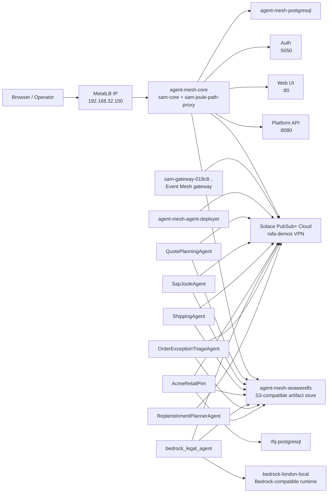

# K8S1 Solace Agent Mesh Runtime Inventory

Snapshot date: 2026-04-14  
Source: live `kubectl`, `helm`, and platform API checks against `emeak8s1` (`192.168.31.57`) and the active SAM endpoint `http://192.168.32.100/`

## Purpose
This document is the single operational reference for the Solace Agent Mesh stack running on `k8s1` in the London lab. It describes what is deployed, what each component does, how traffic flows, what is externally reachable, and which live customizations matter for maintenance.

## 1. High-Level Topology


## 2. Cluster Baseline
- Host: `emeak8s1`
- OS: Ubuntu 24.04.4 LTS
- Kubernetes distribution: k3s `v1.34.4+k3s1`
- Node count: 1
- Active node: `emeak8s1`
- Container runtime: `containerd`
- Service account used by SAM workloads: `solace-agent-mesh-sa`
- Image pull secret attached to that service account: `gcr-reg-secret`

## 3. Active Helm Releases in `default`
| Release | Chart | Role |
|---|---|---|
| `agent-mesh` | `solace-agent-mesh-1.2.1` | Core SAM enterprise stack |
| `sam-gateway-019c8bae-34f8-7402-8a1b-7b223c6ca28c` | `sam-agent-1.2.2` | Event Mesh gateway |
| `sap-joule-agent` | `sam-agent-1.2.2` | SAP Joule integration agent |
| `shipping-agent` | `sam-agent-1.2.2` | Shipping rates / logistics agent |
| `quote-planning-agent` | `sam-agent-1.2.2` | RFQ orchestration agent |
| `acme-retail-pim` | `sam-agent-1.2.2` | Product information / SQL-backed PIM agent |
| `bedrock-legal-agent` | `sam-agent-1.2.2` | Legal/compliance agent using Bedrock-compatible runtime |
| `order-exception-triage-agent` | `sam-agent-1.2.4` | Operations exception handling agent |
| `replenishment-planner-agent` | `sam-agent-1.2.4` | Replenishment planning agent |
| `rfq-postgresql` | `postgresql-18.5.5` | Dedicated PostgreSQL for RFQ/PIM/ops agents |

## 4. Core SAM Components

### 4.1 `agent-mesh-core`
Purpose: runs the SAM enterprise control plane.

Live pod composition:
- `sam-core` -> `gcr.io/gcp-maas-prod/solace-agent-mesh-enterprise:1.97.2`
- `sam-joule-path-proxy` -> `nginxinc/nginx-unprivileged:1.27-alpine`

Responsibilities:
- Web UI
- platform API
- orchestrator (`OrchestratorAgent`)
- auth service
- shared enterprise control-plane behavior

Internal ports exposed by the service:
- `80` -> Web UI
- `443` -> Web UI TLS
- `8080` -> Platform API
- `4443` -> Platform TLS
- `5050` -> Auth

Persistence used by core:
- PostgreSQL: `agent-mesh-postgresql`
- S3-compatible artifact storage: `agent-mesh-seaweedfs`

### 4.2 `agent-mesh-agent-deployer`
Purpose: receives deployment requests from the platform and installs/updates standalone `sam-agent` Helm releases.

Current important live setting:
- `NAMESPACE=solace-agent-mesh-no-auth`

This matters because deployer heartbeat/status depends on publishing into the same namespace that core expects. A mismatch here causes the UI banner:
- `Deployment is unavailable. Agents and gateways can be created, updated, and saved, but not deployed.`

### 4.3 `sam-gateway-019c8bae-34f8-7402-8a1b-7b223c6ca28c`
Purpose: Event Mesh gateway connected to the Solace broker.

Image:
- `gcr.io/gcp-maas-prod/solace-agent-mesh-enterprise:1.97.2`

Role:
- subscribes to mesh topics
- forwards inbound broker events into SAM task execution
- targets `OrchestratorAgent`

## 5. Persistence Layer

### 5.1 `agent-mesh-postgresql`
Purpose: core SAM metadata and session persistence.

Live state:
- StatefulSet `1/1`
- Service port `5432`
- PVC: `data-agent-mesh-postgresql-0` (`10Gi`, `local-path`)

### 5.2 `agent-mesh-seaweedfs`
Purpose: artifact and file storage for the mesh.

Live state:
- StatefulSet `1/1`
- Headless service
- Ports: `9333` (master), `8333` (S3 API)
- PVC: `data-agent-mesh-seaweedfs-0` (`20Gi`, `local-path`)

Operational note:
- the core init container readiness check had to be changed from `wget --spider` to `wget -qO-` because the SeaweedFS S3 status path responds correctly to `GET` but not to the `HEAD` request sent by `--spider`.

### 5.3 `rfq-postgresql`
Purpose: dedicated PostgreSQL for RFQ, PIM, and operations-specific agent data.

Live state:
- StatefulSet `1/1`
- Service port `5432`
- PVC: `data-rfq-postgresql-0` (`8Gi`, `local-path`)

## 6. Custom and Standalone Agents

### 6.1 RFQ / Sales / Legal Stack
| Agent | Image | Purpose |
|---|---|---|
| `QuotePlanningAgent` | `docker.io/library/rfq-agent-suite:local-v1972` | Orchestrates RFQ flows across PIM, SAP, shipping, and legal |
| `SapJouleAgent` | `docker.io/library/rfq-agent-suite:local-v1972` | Queries SAP Joule for sourcing, inventory, lead times |
| `ShippingAgent` | `docker.io/library/rfq-agent-suite:local-v1972` | Returns shipping rates and ETA options |
| `AcmeRetailPim` | `docker.io/library/rfq-agent-suite:local-v1972` | SQL-backed product catalog and attribute lookup |
| `bedrock_legal_agent` | `docker.io/library/bedrock-legal-agent:local-v1972` | Legal/compliance analysis via Bedrock-compatible runtime |

### 6.2 Operations Reuse Stack
| Agent | Image | Purpose |
|---|---|---|
| `OrderExceptionTriageAgent` | `docker.io/library/rfq-agent-suite:local-v1972` | Delayed shipment, damaged order, failed fulfillment triage |
| `ReplenishmentPlannerAgent` | `docker.io/library/rfq-agent-suite:local-v1972` | Replenishment and forward stock planning |

### 6.3 Supporting Runtime
| Component | Image | Purpose |
|---|---|---|
| `bedrock-london-local` | `docker.io/library/bedrock-london-local:local-v1` | FastAPI Bedrock-compatible runtime used by `bedrock_legal_agent` |

## 7. Discovered Agent Cards
The platform currently advertises 8 agent cards:
- `OrchestratorAgent`
- `QuotePlanningAgent`
- `SapJouleAgent`
- `ShippingAgent`
- `AcmeRetailPim`
- `bedrock_legal_agent`
- `OrderExceptionTriageAgent`
- `ReplenishmentPlannerAgent`

Operational nuance:
- discovered A2A agents can appear in `agentCards` even when the platform-managed `Agents` inventory only shows the orchestrator record.
- if the UI shows only one agent in the platform inventory, that does not automatically mean discovery is broken.

## 8. Active Projects / Workflows
The platform currently has 2 configured projects:

### `RFQ Automation`
- default agent: `QuotePlanningAgent`
- purpose: multi-agent RFQ handling using PIM, SAP Joule, shipping, and legal review

### `Operations Reuse Showcase`
- default agent: `OrderExceptionTriageAgent`
- purpose: reusable post-order exception and replenishment workflows

## 9. Network Exposure

### 9.1 Primary external endpoint
Active user-facing SAM endpoint:
- `http://192.168.32.100/`

This is provided by:
- service: `sam-joule`
- type: `LoadBalancer`
- external IP: `192.168.32.100`

Ports exposed on `sam-joule`:
- `80`
- `443`
- `8080`
- `4443`
- `5050`

### 9.2 Other services in `default`
- `agent-mesh` -> `LoadBalancer`, but external IP remains `<pending>`
- `bedrock-london-local` -> `ClusterIP:8000`
- `agent-mesh-postgresql` -> `ClusterIP:5432`
- `rfq-postgresql` -> `ClusterIP:5432`
- `agent-mesh-seaweedfs` -> headless service on `9333` and `8333`

### 9.3 Ingresses
- `default/agent-mesh-webui` -> class `nginx`, host `mesh.internal`
- `default/agent-mesh-webui-ingress` -> class `traefik`, host `agentmesh.local.mesh`
- `cattle-system/rancher` -> `192.168.31.57.sslip.io`
- `ollama/ollama-ingress` -> `ollama.local.mesh`

## 10. MetalLB
MetalLB is installed and active.

Current configuration:
- IP pool: `raphael-192-168-32-pool`
- range: `192.168.32.100-192.168.32.149`
- L2 advertisement: `raphael-l2`

Currently assigned public lab IP:
- `default/sam-joule` -> `192.168.32.100`

## 11. Runtime Usage Snapshot
Live metrics at snapshot time:
- node CPU: `1090m` (`13%`)
- node memory: `11564Mi` (`36%`)

Selected pod memory footprint:
- `agent-mesh-core` -> ~`642Mi`
- `sam-gateway-...` -> ~`584Mi`
- each standalone RFQ/ops agent -> roughly `598Mi` to `604Mi`
- `bedrock-london-local` -> ~`103Mi`
- `agent-mesh-seaweedfs` -> ~`225Mi`

Interpretation:
- the lab is memory-heavier than CPU-heavier
- scheduling pressure tends to come from CPU requests rather than actual CPU usage

## 12. Secrets and Config Groups
Only names are documented here.

Core groups present:
- `agent-mesh-environment`
- `agent-mesh-persistence`
- `agent-mesh-postgresql`
- `agent-mesh-seaweedfs`
- `agent-mesh-init-credentials`
- `solace-broker-auth`

Agent-specific groups present:
- `*-db-bridge`
- `*-env-vars`
- `*-persistence`
- credentials such as `sap-joule-credentials` and `shipping-agent-credentials`

Image pulls:
- `gcr-reg-secret` is attached to `solace-agent-mesh-sa`

## 13. Important Live Customizations
These are important because they are operational drift from a plain chart install.

### 13.1 Root UI now serves current bundles
A stale `index.html` override had been mounted into `agent-mesh-core` and was hardcoding old `/sam-joule/assets/...` bundle names. That override was removed live so `http://192.168.32.100/` now loads the current assets from `/assets/...` correctly.

Implication:
- if `agent-mesh-core` is redeployed from a manifest that remounts the old override, the UI can become blank again.

### 13.2 Deployer namespace alignment
`agent-mesh-agent-deployer` was patched so its `NAMESPACE` matches the namespace expected by core for heartbeat/deployment status.

Implication:
- if this patch is lost, the deployer may appear healthy but the UI can still show `Deployment is unavailable`.

### 13.3 Sidecar path proxy still present
`agent-mesh-core` still includes the `sam-joule-path-proxy` sidecar. It remains part of the live deployment even though the root UI is currently served successfully without the stale frontend index override.

### 13.4 Mixed ServiceLB + MetalLB behavior
`agent-mesh` can stay `<pending>` while `sam-joule` is the active MetalLB-backed external endpoint. This is expected in the current lab setup.

## 14. Quick Health Checks
Run from `emeak8s1` or through the repo helper scripts.

```bash
kubectl get pods -n default -o wide
kubectl get svc -n default
kubectl get ingress -A
helm list -n default
kubectl -n metallb-system get ipaddresspool,l2advertisement
curl -s http://192.168.32.100/api/v1/platform/health
curl -s http://192.168.32.100/api/v1/agentCards | jq '.[].name'
curl -s 'http://192.168.32.100/api/v1/projects?include_artifact_count=true'
```

## 15. Operational Caveats
- `sam-joule` at `192.168.32.100` is the real endpoint to trust. `agent-mesh` service exposure is not the active public path.
- A successful UI shell load does not prove platform/API health. Always confirm the platform API on `:8080` or via `/api/v1/platform/health`.
- Discovered agents and platform-managed agents are not the same inventory. Use `agentCards` when debugging mesh discovery.
- The live stack contains manual fixes. A future Helm upgrade can revert them if the repo-side manifests do not encode the same state.

## 16. Current Bottom Line
The `k8s1` SAM environment is a single-node London lab deployment with:
- core SAM enterprise stack on `1.97.2`
- one event-mesh gateway
- seven standalone custom agents
- one Bedrock-compatible helper runtime
- core PostgreSQL + SeaweedFS persistence
- separate RFQ PostgreSQL
- MetalLB-exposed user endpoint at `192.168.32.100`
- two active business workflows/projects: RFQ and Operations Reuse
